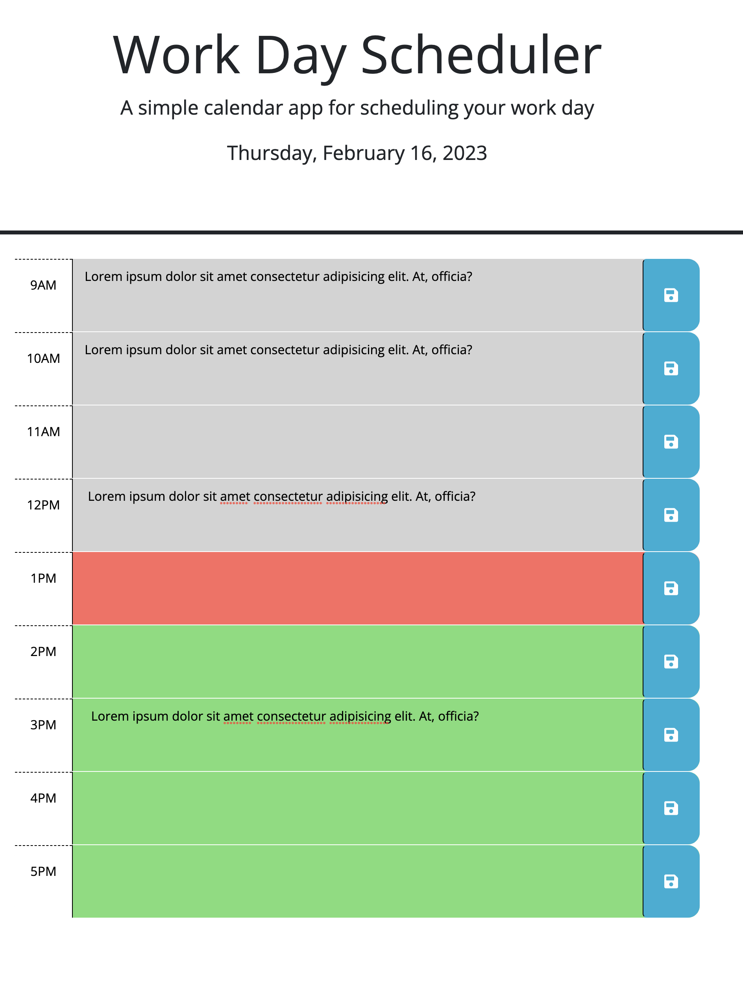

# Decsription
### A calendar application that allows a user to save events for each hour of the day by modifying starter code. 
##### The user is allow to add/revise/delete saved events
##### The past/current/future hour are displayed in different colors.  
# Links

The code: https://github.com/unbmattzhao/Work_Day_Scheduler

The Page: https://unbmattzhao.github.io/Work_Day_Scheduler/

# Screenshots

